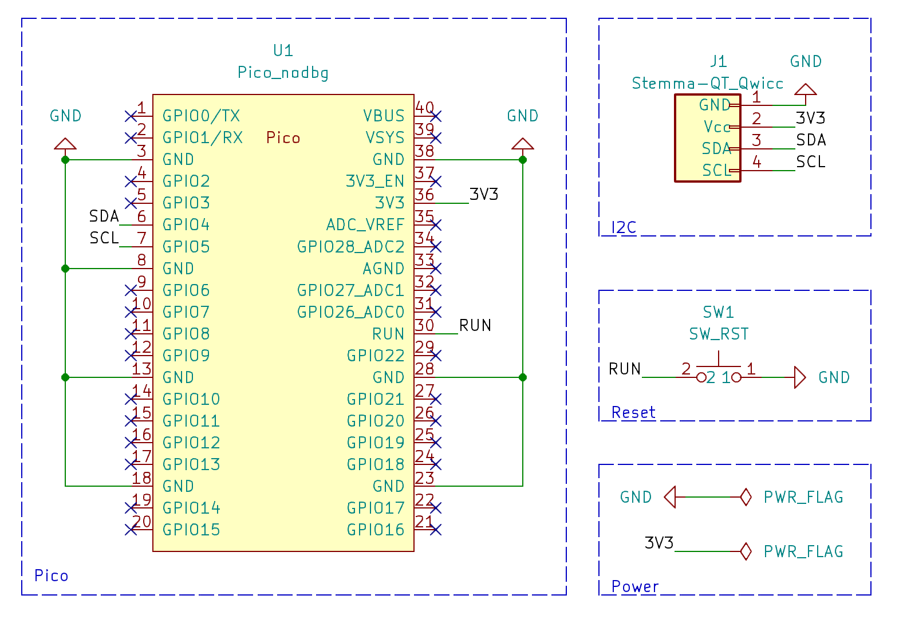
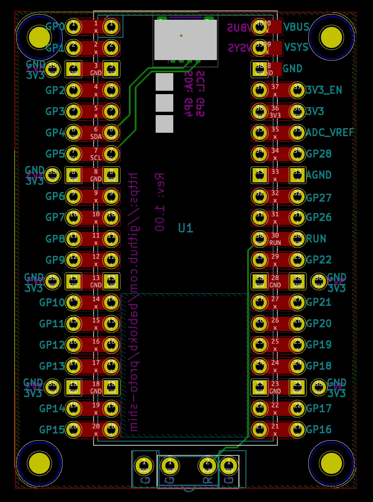
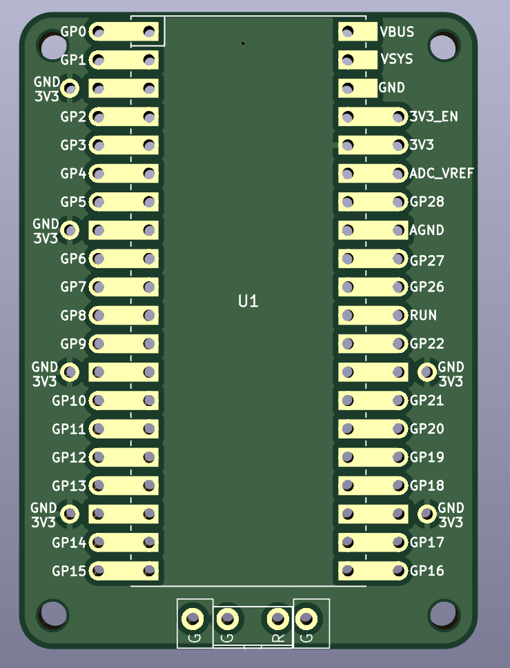
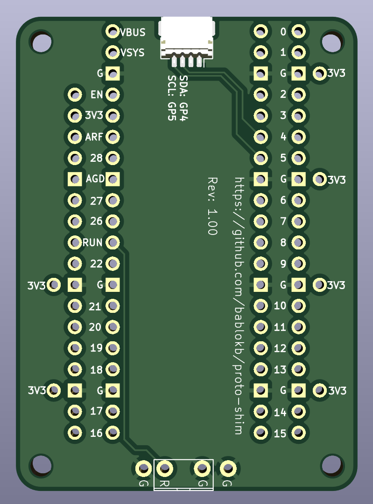

Protoyping Shim for the Raspberry Pi Pico
=========================================

This is a small prototyping shim for the Pico. Besides
the normal 2x20 through holes for the Pico, the PCB also
provides additional holes for the connection of peripherals.
Most importantly there are multiple connectors for GND and 3V3
available.

Schematic
---------

Layout
------

3D-Views
--------

License
-------

[![CC BY-SA 4.0][cc-by-sa-shield]][cc-by-sa]

This work is licensed under a
[Creative Commons Attribution-ShareAlike 4.0 International
License][cc-by-sa].

[![CC BY-SA 4.0][cc-by-sa-image]][cc-by-sa]

[cc-by-sa]: http://creativecommons.org/licenses/by-sa/4.0/
[cc-by-sa-image]: https://licensebuttons.net/l/by-sa/4.0/88x31.png
[cc-by-sa-shield]:
https://img.shields.io/badge/License-CC%20BY--SA%204.0-lightgrey.svg
